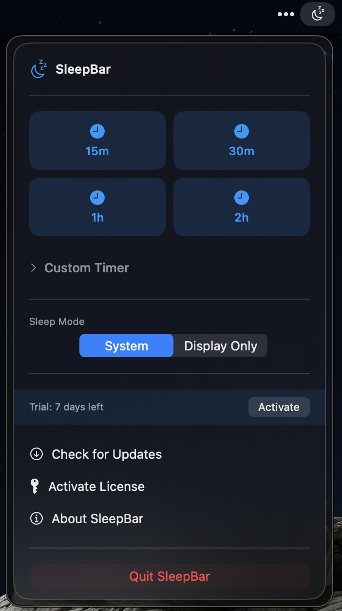

# SleepBar

  

  <strong>A simple and elegant sleep timer for macOS</strong>

  
  
  
  

---

## 🌙 About SleepBar

SleepBar is a beautiful menu bar app that lets you set your Mac to sleep after a duration or at a specific time. Perfect for:
- Listening to music or podcasts before bed
- Overnight downloads or long-running tasks
- Controlling screen time
- Energy savings

---

## ✨ Features

- ⏱️ **Quick Timers**: Preset options for 15, 30, 60, and 120 minutes
- 🎯 **Custom Duration**: Set any duration with hours and minutes
- 🕐 **Specific Time**: Schedule sleep for an exact time
- 💻 **Sleep Modes**: Choose system sleep or display-only sleep
- ⚠️ **Pre-Sleep Warning**: 1-minute notification before sleep
- ✨ **Beautiful Design**: Liquid glass UI following Apple's guidelines
- 🔄 **Auto-Updates**: Seamless updates via Sparkle

---

## 📥 Download

**Latest Version**: [Download SleepBar](https://github.com/zcpnate/sleepbar/releases/latest/download/SleepBar.dmg)

**Requirements**: macOS 14.0 (Sonoma) or later

---

## 🎁 Pricing

- **7-day free trial** (no credit card required)
- **$4.20** one-time purchase
- Lifetime updates included
- Use on 3 Macs

[Purchase License](https://zcpnate.lemonsqueezy.com/buy/PRODUCT_ID)

---

## 📖 Changelog

See [CHANGELOG.md](CHANGELOG.md) for version history.

---

## 🌐 Website

Visit [sleepbar.app](https://sleepbar.app) for more information.

---

## 📧 Support

- **Email**: [nate@sleepbar.app](mailto:nate@sleepbar.app)
- **Issues**: [Report a bug](https://github.com/zcpnate/sleepbar/issues)

---

## 📄 License

© 2025 Nate O'Farrell. All rights reserved.
